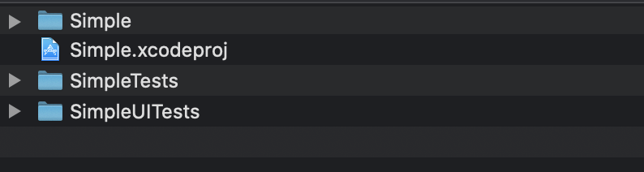
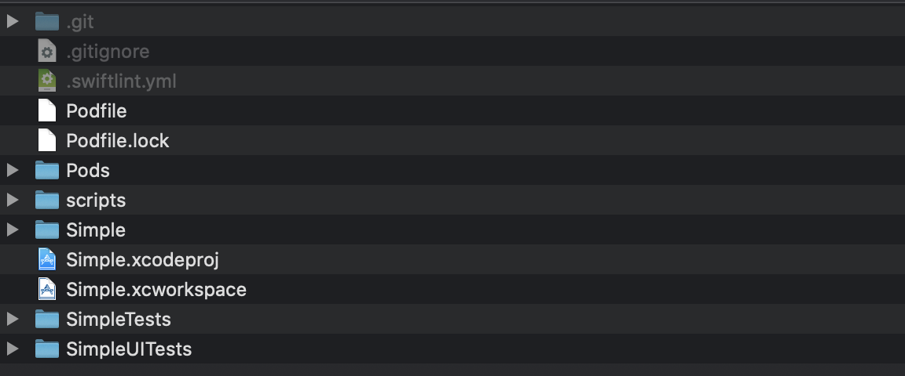

Setup Helper
====
This tool help to create Xcode Project.
Make Podfile and install SwiftLint and SwiftFormat on your project ...etc

## Description

- copy `.swiftlint.yml` and `scripts` on your Project
- make Podfile `pod init`
- Add Library in Podfile
  - Add SwiftLint in Podfile
  - Add SwiftFormat in Podfile
- Pod install on your Project
- Git initialize `git init`
- Download .gitignore file and set it on your Project

## Demo

| before | after |
|:---:|:---:|
|||

## Requirements & Support
- Python 3.8.0

## Usage

```
python helper.py (your project directory)
```

## Install

```
git clone https://github.com/masa7351/setupHelper.git
```

## Licence

[MIT](https://github.com/masa7351/setupHelper/blob/master/LICENSE.md)

## Author

[masa7351](https://github.com/masa7351)